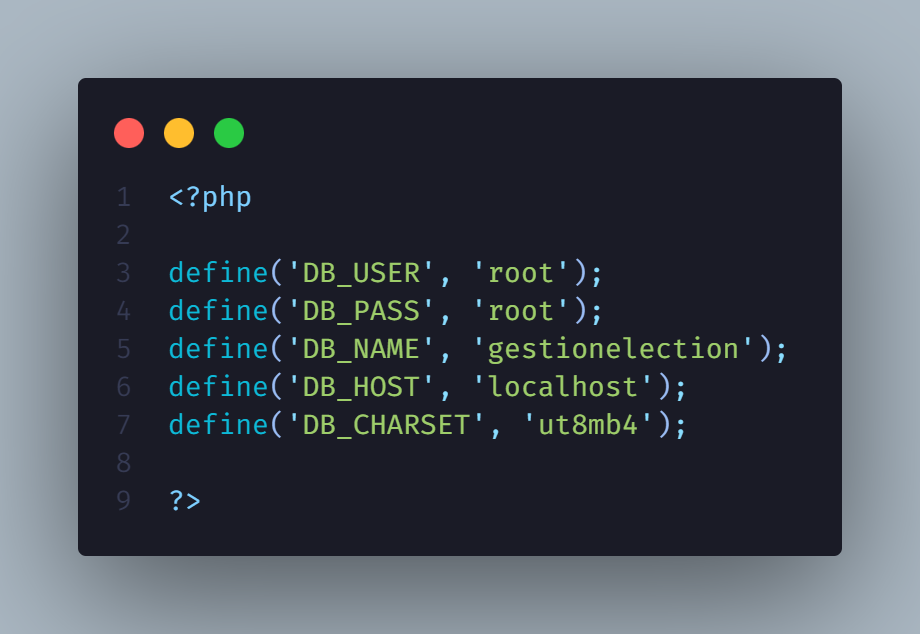
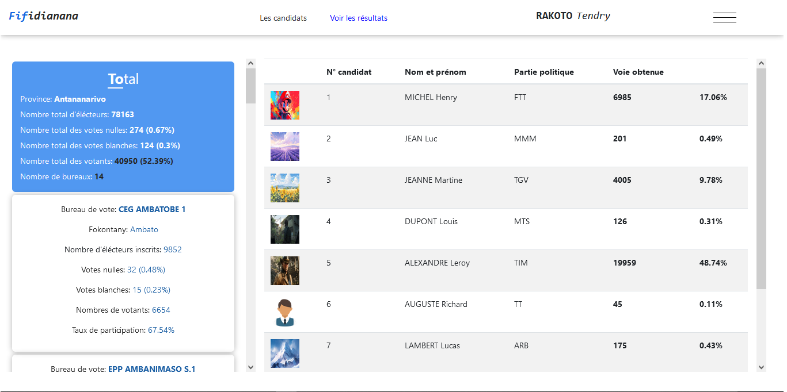

# Système de gestion d'éléction

## Description
Une application en PHP pour la gestion des éléctions, y compris l'administration des candidats, le suivi des votes et la génération des résultats.

## Fonctionnalités

- Gestion des candidats et des données éléctorales.
- Processus de vote sécurisé avec la mise à jour des résultats en temps réel.
- Interface conviviale avec rôles administrateur et utilisateur.

## Structure du Projet

- `src/` : Contient la logique principale de l'application.
  - `controller/` : Contient les contrôleurs.
  - `model/` : Contient les modèles.
  - `middleware/` : Contient les middlewares.
  - `view/` : Contient les vues.

- `config/` : Contient les configurations de l'application.
  - `DataBase.php` : Classe de connexion à la base de données.
  - `Router.php` : Fichier de routage utilisant Altorouter.
  - `Constante.php` : Fichier contenant les constantes pour la connexion à la base de données.

- `public/` : Contient les fichiers accessibles publiquement.
  - `index.php` : Point d'entrée de l'application.
  - `assets/` : Contient les scripts et les styles.
  - `components/` : Contient les fichiers réutilisables.

- **composer.json** : Fichier de configuration pour Composer, gérant les dépendances du projet.
- **vendor/** : Contient les bibliothèques et les dépendances installées via Composer.
- **database.sql** : Fichier SQL pour initialiser la base de données.

## Installation
- Excécution du Fichier SQL :
    Pour initialiser votre base de données avec le schéma et les données nécessaires, exécutez le fichier `database.sql` situé à la racine du projet dans votre SGBD 	 

- Modifier le fichier Constante.php dans le dossier config/ :
     
     Modifier les constantes de connexion avec vos informations

- Démarrez le serveur de développement :
    - Ouvrir le terminal et naviguez vers le répértoire où vous avez placé le projet et taper la commande :
    php -S localhost:8000 -t public
    - Ou démarrer votre serveur de développement (xampp, wampp, ...)

## Informations de connexion 
  ### Administrateur
      - URL de connexion : 'http://localhost:8000/login'
      - Email : admin01@gmail.com
      - Mot de passe : admin01
  ### Utilisateur
      - URL de connexion : 'http://localhost:8000/login'
      - Email : user01@gmail.com
      - Mot de passe : user01

## Illustrations

## Contributions
Les contributions sont les bienvenues ! Veuillez ouvrir une issue ou soumettre une pull request pour toute amélioration ou correction de bugs.

## Contact
- **Nom** : Tendry Zéphyrin
- **Email** : tendryzephyrin@gmail.com
- **GitHub** : [Tendry-Rkt56](https://github.com/Tendry-Rkt56)